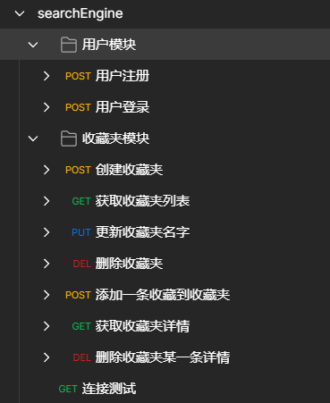

# Tangseng 基于Go语言的搜索引擎

# 项目大体框架

1、gin作为http框架，grpc作为rpc框架，etcd作为服务发现。\
2、总体服务分成`用户模块`、`收藏夹模块`、`搜索引擎模块`。\
3、用户模块和收藏夹模块使用共同的数据库。\
4、搜索引擎单独设立数据库，并且预留了一个redis作为缓存，存储搜索引擎数据采用读写分离模式，主要负责读，次要负责写，允许主从复制的延迟。

# 🧑🏻‍💻 前端地址

前端用的是 react, but still coding

[react-tangseng](https://github.com/CocaineCong/react-tangseng)

# 🌈 项目主要功能
## 1. 用户模块
- 登录注册

## 2. 收藏夹模块
- 创建/更新/删除/展示 收藏夹
- 将搜索结果的url进行收藏夹的创建/删除/展示

## 3. 搜索模块

> * x.term存储term文件
> * x.forward存储正排文件
> * x.inverted存储倒排索引文件
> * segments.json 存储segment元数据信息，包括上述文件属性

#### 正排库
* 正排文件，通过 bolt 进行kv存储 docid 主键
#### 倒排库
* term文件 bolt存储，key为token，value 为对应token的postingslist，但由于文件太大了，后续改成倒排索引文件的offset和size，压缩存储容量

**后续看实现难度，能不能用mmap来读取倒排索引** 

#### segment merge
* channel 实现消息队列，flush后发送消息
* term merge通过b+tree前序遍历，重组b+tree
* 倒排表merge的话，可以通过merge b+树的时候，读取倒排表数据，进行读取后重写，效率可能会慢，待定
* 需要添加segment的引用计数，为0才可以删除
* 正排也是b+tree操作

#### engine 对象
> engine是recall召回和index索引的控制模块
* 通过engine mode区分是查询还是写入，主要需要标识出要处理的segment，recall使用cur_seg_id，index使用next_seg_id
* 召回和索引是不同的engine
* 召回上层有多个engine
* recall 召回时会在engine上层进行多segment合并（单个segment没问题，多个有时候有问题，会阻塞，后续优化一下）

### 未来规划
#### 1.架构相关

- [ ] 引入降级熔断
- [ ] 引入jaeger进行链路追踪
- [ ] 引入skywalking进行监控

#### 2.功能相关

- [ ] 构建索引的时候太慢了..想办法优化..都不知道wukong是怎么做的构建索引那么快的...
- [ ] 索引压缩，bolt产生的三个文件过多，太大了，因为目前存的是postingsList，也就是倒排索引表，后续改成存offset
- [x] 相关性的计算要考虑一下，TFIDF，bm25
- [ ] 词向量，pagerank
- [x] 分词加入ik分词器
- [ ] 多个segment召回结合合并，并且差运输
- [ ] 分页，排序
- [ ] 纠正输入的query,比如“陆加嘴”-->“陆家嘴”
- [ ] 输入进行词条可以进行联想，比如 “东方明” 提示--> “东方明珠”
- [ ] 目前是基于块的索引方法，后续看看能不能改成分布式mapreduce来构建索引
- [ ] 在上一条的基础上再加上动态索引（还不知道上一条能不能实现...）


# 项目主要依赖
- gin
- gorm
- etcd
- grpc
- jwt-go
- logrus
- viper
- protobuf

# ✨ 项目结构

## 1.tangseng 项目总体
```
tangseng/
├── app                   // 各个微服务
│   ├── favorite          // 收藏夹
│   ├── gateway           // 网关
│   ├── search-engine     // 新版搜索微服务
│   └── user              // 用户模块微服务
├── bin                   // 编译后的二进制文件模块
├── config                // 配置文件
├── consts                // 定义的常量
├── doc                   // 接口文档
├── idl                   // protoc文件
│   └── pb                // 放置生成的pb文件
├── loading               // 全局的loading，各个微服务都可以使用的工具
├── logs                  // 放置打印日志模块
├── pkg                   // 各种包
│   ├── ctl               // 用户信息相关
│   ├── discovery         // etcd服务注册、keep-alive、获取服务信息等等
│   ├── es                // es 模块
│   ├── jwt               // jwt鉴权
│   ├── logger            // 日志
│   ├── res               // 统一response接口返回
│   ├── util              // 各种工具、处理时间、处理字符串等等..
│   └── wrappers          // 熔断
└── types                 // 定义各种结构体
```

## 2.gateway 网关部分
```
gateway/
├── cmd                   // 启动入口
├── internal              // 业务逻辑（不对外暴露）
│   ├── handler           // 视图层
│   └── service           // 服务层
│       └── pb            // 放置生成的pb文件
├── logs                  // 放置打印日志模块
├── middleware            // 中间件
├── routes                // http 路由模块
└── rpc                   // rpc 调用
```

## 3.user && favorite 用户与收藏夹模块
```
user/
├── cmd                   // 启动入口
└──internal               // 业务逻辑（不对外暴露）
   ├── service            // 业务服务
   └── repository         // 持久层
       └── db             // 视图层
           ├── dao        // 对数据库进行操作
           └── model      // 定义数据库的模型
```

## 4.search-engine 搜索引擎模块

```
seach-engine/
├── cmd                   // 启动入口
├── data                  // 放置打印日志模块
├── engine                // 中间件
├── index                 // 索引建立
├── inputdata             // 输入的数据
├── logic                 // 共有逻辑
├── query                 // 分词 查询
├── recall                // 回归
├── respository           // 存储信息
├── segment               // meta分块
├── service               // 服务
├── storage               // 存储信息
├── test                  // 测试文件
└── types                 // 定义的结构体
```

# 项目文件配置

将config文件夹下的`config.yml.example`文件重命名成`config.yml`即可。

```yaml
server:
  port: :4000
  version: 1.0
  jwtSecret: 38324-search-engine

mysql:
  driverName: mysql
  host: 127.0.0.1
  port: 3306
  database: search_engine
  username: search_engine
  password: search_engine
  charset: utf8mb4

redis:
  user_name: default
  address: 127.0.0.1:6379
  password:

etcd:
  address: 127.0.0.1:2379

services:
  gateway:
    name: gateway
    loadBalance: true
    addr:
      - 127.0.0.1:10001 

  user:
    name: user
    loadBalance: false
    addr:
      - 127.0.0.1:10002 # 监听地址

  favorite:
    name: favorite
    loadBalance: false
    addr:
      - 127.0.0.1:10003 # 监听地址

  searchEngine:
    name: favorite
    loadBalance: false
    addr:
      - 127.0.0.1:10004 # 监听地址

domain:
  user:
    name: user
  favorite:
    name: favorite
  searchEngine:
    name: searchEngine
```


# 项目启动
## makefile启动

启动命令

```shell
make env-up         # 启动容器环境
make user           # 启动用户摸块
make task           # 启动任务模块
make gateway        # 启动网关
make env-down       # 关闭并删除容器环境
```

其他命令
```shell
make proto # 生成proto文件，如果proto有改变的话，则需要重新生成文件
```
生成.pb文件所需要的工具有`protoc-gen-go`,`protoc-gen-go-grpc`,`protoc-go-inject-tag`


## 手动启动

1. 利用compose快速构建环境
```shell
docker-compose up -d
```
2. 保证mysql,etcd活跃, 在 app 文件夹下的各个模块的 cmd 下执行
```go
go run main.go
```

# 导入接口文档

打开postman，点击导入


选择导入文件


效果


