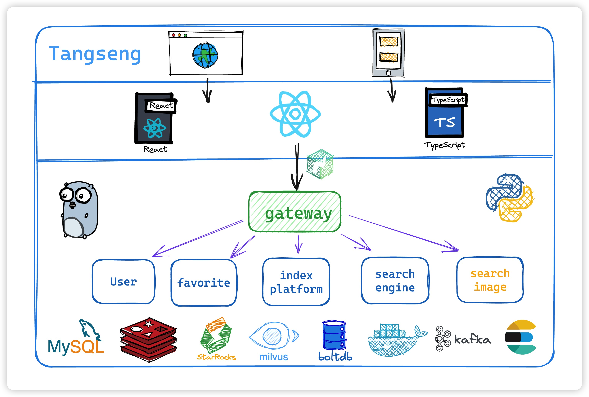

# Tangseng 基于Go语言的搜索引擎

**[项目详细内容地址点击这里](https://cocainecong.github.io/tangseng/#/)**

## 项目大体框架&功能

1. gin作为http框架，grpc作为rpc框架，etcd作为服务发现。
2. 总体服务分成`用户模块`、`收藏夹模块`、`索引平台`、`搜索引擎(文字模块)`、`搜索引擎(图片模块)`。
3. 分布式爬虫爬取数据，并发送到kafka集群中，再落库消费。 (虽然爬虫还没写，但不妨碍我画饼...)
4. 搜索引擎模块的文本搜索单独设立使用boltdb存储index，mapreduce加速索引构建并使用`roaring bitmap`存储索引。
5. 使用trie tree实现词条联想(后面打算加上算法模型辅助词条联想)。
6. 图片搜索使用ResNet50来进行向量化查询 + Milvus or Faiss 向量数据库的查询 (开始做了... DeepLearning也太难了...)。
7. 支持多路召回，go中进行倒排索引召回，python进行向量召回。通过grpc调用连接，进行融合。
8. 支持TF-IDF，BM25等等算法排序。



## 🧑🏻‍💻 前端地址

all in react, but still coding

[react-tangseng](https://github.com/CocaineCong/react-tangseng)

## 未来规划

### 架构相关

- [ ] 引入降级熔断
- [x] 引入jaeger进行全链路追踪(go追踪到python)
- [x] 引入prometheus进行监控
- [ ] 抽离dao的init，用key来获取相关数据库实例
- [ ] 冷热数据分离(参考es的方案,关键在于判断冷热的标准,或许可以写在中间件里面？)
- [ ] 目前来说mysql已经足够存储正排索引，但后续可能直接一步到位到OLAP，starrocks单表亿级数据也能毫秒查询，mysql到这个级别早就分库分表了..

### 功能相关

- [x] 构建索引的时候太慢了.后面加上并发，建立索引的地方加上并发
- [ ] 索引压缩，inverted index，也就是倒排索引表，后续改成存offset,用mmap
- [x] 相关性的计算要考虑一下，TFIDF，bm25
- [x] 使用前缀树存储联想信息
- [ ] 哈夫曼编码压缩前缀树
- [x] 建索引的时候，传文件地址改成传文件流
- [ ] python 引入 bert 模型进行分词的推荐词并提供 grpc 接口
- [ ] inverted 和 trie tree 的存储支持一致性hash分片存储
- [x] 词向量
- [x] pagerank
- [ ] 分离 trie tree 的 build 和 recall 过程
- [x] 分词加入ik分词器
- [x] 构建索引平台，计算存储分离，构建索引与召回分开
- [ ] 并且差运算 (位运算)
- [ ] 分页
- [x] 排序
- [ ] 纠正输入的query,比如"陆加嘴"-->"陆家嘴"
- [x] 输入进行词条可以进行联想，比如 "东方明" 提示--> "东方明珠"
- [x] 目前是基于块的索引方法，后续看看能不能改成分布式mapreduce来构建索引 (6.824 lab1)
- [ ] 在上一条的基础上再加上动态索引（还不知道上一条能不能实现...）
- [x] 改造倒排索引，使用 roaring bitmap 存储docid (好难)
- [ ] 实现TF类
- [x] 搜索完一个接着搜索，没有清除缓存导致结果是和上一个产生并集
- [x] 排序器优化
- [x] 并发进行多路召回
- [ ] 为什么子模块改动，比如search_engine模块改动，gateway要重启才能生效？复现步骤:改动了proto之后需要重启gateway
- [ ] 写一个shell for start program吧，每次都手动启动有点难定（高优）


## 快速开始
   环境启动！

   ```shell
   make env-up
   ```

小小数据集就在 `source_data/movies_data.csv` 

### Python 启动!

1. 确保电脑已经安装了python,确保python version>=3.9,我的版本是3.10.2

    ```shell
    python --version
    ```

2. 安装venv环境

    ```shell
    python -m venv venv
    ```

3. 激活 venv python 环境
    
   macos:

    ```shell
    source venv/bin/activate
    ```

    windows:

    等我清完C盘再兼容一下...还没在win上跑过...

4. 安装第三方依赖

   ```python
   pip install -r requirements.txt
   ```
5. 启动主程序
   ```python
   sh python-start.sh
   ```
6. 启动脚本构建索引
    ```python
    make python-consume
    ```

### Golang 启动! 

golang version >= go 1.16 即可。我的go版本是 1.18.6

1. 下载第三方依赖包

    ```shell
    go mod tidy
    ```

2. 目录下执行

    ```shell
    make run-xxx(user,favortie ...)
    # e.g:
    # make run-user
    # make run-favorite
    # 具体看makefile文件
    ```

## 开源贡献

在提交pr之前，请查看 `CONTRIBUTING_CN.md`