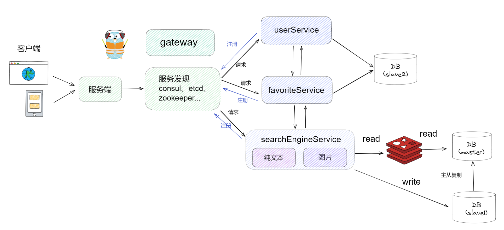

# Go-SearchEngine

基于Go语言的搜索引擎

# 项目大体框架



1、gin作为http框架，grpc作为rpc框架，etcd作为服务发现。\
2、总体服务分成`用户模块`、`收藏夹模块`、`搜索引擎模块`。\
3、用户模块和收藏夹模块使用共同的数据库。\
4、搜索引擎单独设立数据库，并且预留了一个redis作为缓存，存储搜索引擎数据采用读写分离模式，主要负责读，次要负责写，允许主从复制的延迟。

# 项目主要依赖
- gin
- gorm
- etcd
- grpc
- jwt-go
- logrus
- viper
- protobuf

# 项目结构

## 1. api-gateway 网关部分

```
api-gateway/
├── cmd                   // 启动入口
├── config                // 配置文件
├── discovery             // etcd服务注册、keep-alive、获取服务信息等等
├── internal              // 业务逻辑（不对外暴露）
│   ├── handler           // 视图层
│   ├── repository        // 持久层
│   └── service           // 服务层
│       └──pb             // 放置生成的pb文件
├── logs                  // 放置打印日志模块
├── middleware            // 中间件
├── pkg                   // 各种包
│   ├── e                 // 统一错误状态码
│   ├── res               // 统一response接口返回
│   └── util              // 各种工具、JWT、Logger等等..
├── routes                // http路由模块
└── wrappers              // 各个服务之间的熔断降级
```

## 2. favorites && user 收藏夹与用户模块


```
user/
├── cmd                   // 启动入口
├── config                // 配置文件
├── discovery             // etcd服务注册、keep-alive、获取服务信息等等
├── internal              // 业务逻辑（不对外暴露）
│   ├── handler           // 视图层
│   ├── cache             // 缓存模块
│   ├── repository        // 持久层
│   └── service           // 服务层
│       └──pb             // 放置生成的pb文件
├── logs                  // 放置打印日志模块
├── pkg                   // 各种包
│   ├── e                 // 统一错误状态码
│   ├── res               // 统一response接口返回
│   └── util              // 各种工具、JWT、Logger等等..
├── routes                // http路由模块
└── wrappers              // 各个服务之间的熔断降级
```

## 3. search-english 搜索模块


# 项目文件配置

各模块下的`config/config.yml`文件


```yaml
server:
# 模块
  domain: user
  # 模块名称
  version: 1.0
  # 模块版本
  grpcAddress: "127.0.0.1:10001"
  # grpc地址

datasource:
# mysql数据源
  driverName: mysqlMaster
  host: 127.0.0.1
  port: 3306
  database: basicInfo
  # 数据库名
  username: root
  password: root
  charset: utf8mb4

etcd:
# etcd 配置
  address: 127.0.0.1:2379

redis:
# redis 配置
  address: 127.0.0.1:6379
  password:
```

# 导入接口文档

打开postman，点击导入


选择导入文件


效果


# 项目启动
- 在各模块下进行

```go
go mod tidy
```

- 在各模块下的cmd目录

```go
go run main.go
```