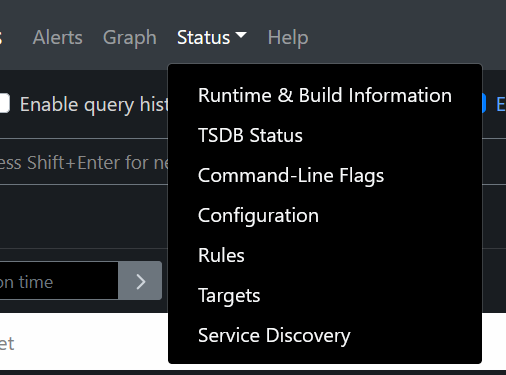
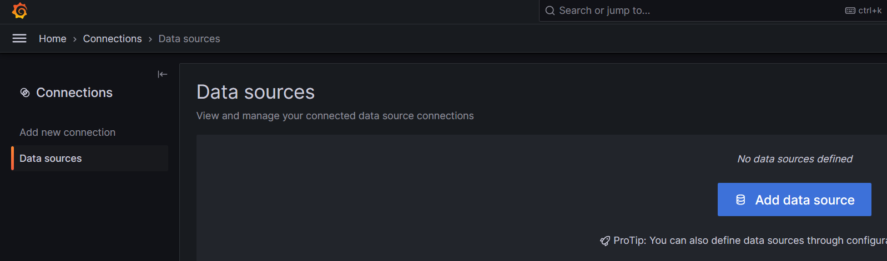
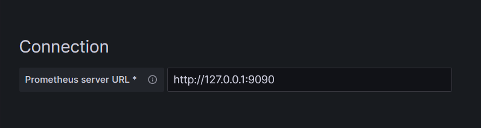
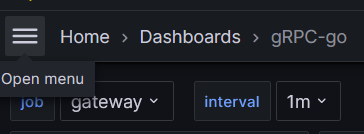

# 一份简单的说明

## 关于docker-compose.yaml
> 由于监控的特殊性，我没有使用networks将prometheus加入到search_engine网络中
而是选择了host模式让其像在主机上一样工作，出于方便因素考虑，grafana也同样
使用了host模式，如果你想，可以将其加入到search_engine中，记得暴露端口即可

## 关于prometheus ui的简单使用
如果你已经成功的跑起了服务，那么你可以在9090端口访问到prometheus的web界面

点击Targets即可查看当前prometheus所监控的目标  
更多的功能自行探索哈，主要说一下grafana

## 关于grafana的简单使用
### 配置数据源
看到这里相信你已经把服务跑起来啦，只需要访问3000端口，即可进入到grafana的web界面  
接着点击左上角的 menu -> Connections -> Data sources就可以配置prometheus的数据源了

点击Add Source，选择prometheus，填入prometheus所在的地址和端口，拉到最下面save即可

### 查看所采集到的metrics
1. 左上角menu -> Dashboard -> New -> import -> Upload dashboard JSON file  
2. 接着将 prometheus/config 中的两个json文件选一个填进去  
3. 然后选择数据源保存即可。重复上述操作添加另一个json文件进去。
4. 此时已经可以看到相关数据啦，grpc-go中是一个一个的查看，Go metrics中是总括性的

5. 可以选择不同的job来查看，有可能你会看到很多图都没有数据，这是正常的。多发送一些请求给server收集数据就好啦。
